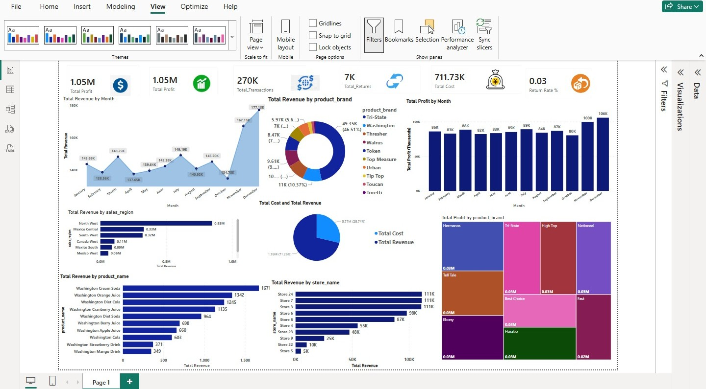

# 🛍️ Retail Sales Analytics Dashboard

## 📌 Project Overview

This project showcases an interactive Retail Sales Analytics Dashboard developed using Microsoft Power BI. It provides a comprehensive view of retail sales performance by analyzing revenue trends, product performance, store performance, and monthly sales. The dashboard is designed to help users explore sales data through interactive visualizations and key performance indicators (KPIs).

---

## 📷 Dashboard Preview

---

## 🎯 Business Objective

The objective of this project is to analyze retail sales data and provide meaningful business insights that support better decision-making. The dashboard allows users to monitor sales performance, compare products and stores, and identify sales trends over time.

---

## 📊 Key Performance Indicators (KPIs)

- Total Sales
- Average Sales per Day
- Sales by Category
- Sales by Product
- Sales by Store Location
- Monthly Sales Trend

---

## 📈 Dashboard Features

- Interactive KPI Cards
- Monthly Sales Trend Analysis
- Category-wise Sales Analysis
- Product-wise Sales Analysis
- Store-wise Sales Analysis
- Interactive Filters
- Treemap Visualization
- Donut Chart
- Line Chart
- Bar Charts

---

## 📂 Dataset

The dashboard is built using three related datasets:

- **Sales** – Transaction ID, Date, Product ID, Store Code and Sales Amount
- **Product** – Product Details and Category Information
- **Store** – Store Name, Store Category and Store Location

---

## 🛠️ Tools & Technologies

- Microsoft Power BI
- Microsoft Excel
- Power Query
- DAX
- Data Modeling

---

## 💡 Key Insights

- Sales performance can be monitored across different months.
- Product-wise analysis helps identify high-performing products.
- Store-wise comparison highlights sales performance across locations.
- Category analysis provides a better understanding of product demand.
- Interactive filters allow users to explore data dynamically.

---

## 🚀 Skills Demonstrated

- Data Cleaning
- Data Transformation
- Data Modeling
- DAX Calculations
- Dashboard Design
- Data Visualization
- Business Intelligence
- KPI Development

---

## 📁 Repository Contents

- dashboard-overview.png
- sales-data.xlsx
- README.md

---

### ⭐ Thank you for visiting this project.

If you like this project, feel free to explore my other Data Analytics projects available on my GitHub profile.
